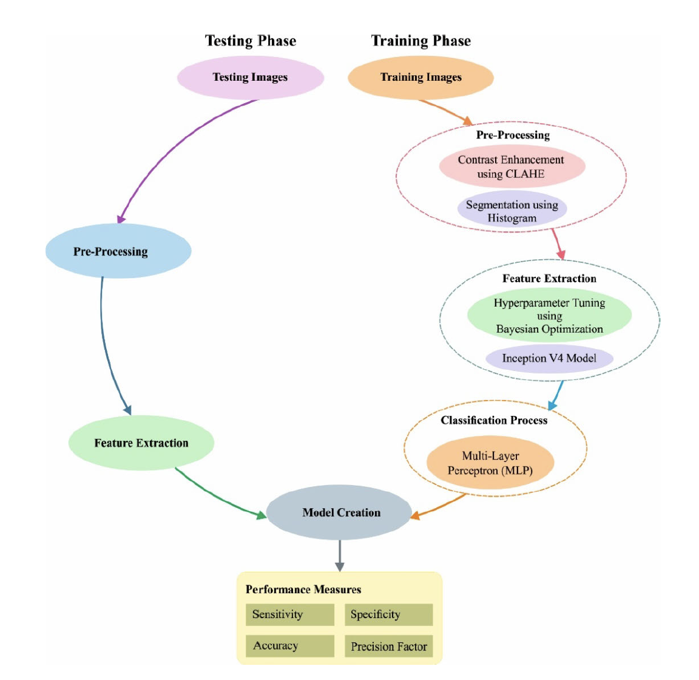

# Sommaire

## I- Abstract
## II- Définitions
## III- Processus
## IV- Formulations Mathématiques
## V- Evaluation du papier
## VI- Ressources
## VII- Conclusion

\newpage
## I- Abstract

_Research paper by K. SHANKAR , YIZHUO ZHANG , YIWEI LIU , LING WU , AND CHI-HUA CHEN_  

La santé est un domaine très important qui n'échappe pas à la transformation digitale. Il est sans doute que l'usage de l'intelligence artificielle avec ses différentes architectures telles que le Deep Learning permettent à une avancée importante dans la résolution des pathogologies. 

L'une d'entre elles est la Rétinopathie Diabétique (RD) qui est une raison majeure de l'augmentation de la perte visuelle dans le monde. Elle est devenue une cause importante de déficience visuelle chez les personnes âgées de 25 à 74 ans. La RD affecte significativement le statut économique dans la société, en particulier dans les systèmes de santé.
Dans ce papier, les auteurs présentent un nouveau modèle Deep Learning nommé (HPTI-v4) basé sur l'optimisation automatique des hyperparamètres  pour la détection et classification des DR à partir d'images couleur du fond de l'œil. 

Au stade du prétraitement, le niveau de contraste du fond l'image sera améliorée par l'utilisation du modèle d'égalisation d'histogramme adaptatif limité (CLAHE).
Ensuite, la segmentation de l'image prétraitée a lieu en utilisant une segmentation basée sur un modèle d'histogramme. 
Le modèle HPTI-v4 est ensuite appliqué pour extraire les fonctionnalités requises de l'image segmentée et il subit par la suite une classification par l'utilisation d'un perceptron multicouche (MLP).

Le test sera appliqué sur un jeu de données appellé MESSIDOR tout en comparant les résultats du modèle présenté avec d'autres modèles ayant déjà prouvés leurs efficacité.


_Dans notre étude, nous présenterons brivement le model en soit et la partie d'optimisation des hyperparamètres qui nous intéresse le plus dans l'optique de montrer son utilité pour améliorer des modèles Deep Learning en les couplant à d'autres techniques._


\newpage


## II- Définitions

### 1- Rétinopathie Diabétique

La rétinopathie diabétique (atteinte des yeux : œil et rétine) est une grave complication du diabète qui touche 50% des patients diabétiques de type 2. Les yeux sont particulièrement sensibles à l'atteinte des petits vaisseaux. En France, la rétinopathie diabétique est la première cause de cécité avant 65 ans.


### 2- Contrast Limited Adaptive Histogram Equalization (CLAHE)

L'égalisation adaptative d'histogramme (AHE) est une technique de traitement d'image informatique utilisée pour améliorer le contraste des images.
L'AHE ordinaire a tendance à suramplifier le contraste dans les régions quasi constantes de l'image, puisque l'histogramme dans ces régions est très concentré. En conséquence, AHE peut provoquer une amplification du bruit dans des régions quasi constantes. Contrast Limited AHE (CLAHE) est une variante de l'égalisation adaptative d'histogramme dans laquelle l'amplification du contraste est limitée, de manière à réduire ce problème d'amplification du bruit.

### 3- MLP (Multilayer Perceptron)

Le perceptron multicouche (multilayer perceptron MLP) est un type de réseau neuronal artificiel organisé en plusieurs couches au sein desquelles une information circule de la couche d'entrée vers la couche de sortie uniquement ; il s'agit donc d'un réseau à propagation directe (feedforward). Chaque couche est constituée d'un nombre variable de neurones, les neurones de la dernière couche (dite « de sortie ») étant les sorties du système global.


### 4- Hyperparamètres
Dans l'apprentissage automatique, un hyperparamètre est un paramètre dont la valeur est utilisée pour contrôler le processus d'apprentissage. En revanche, les valeurs des autres paramètres (généralement la pondération de nœuds) sont obtenues par apprentissage.

Les hyperparamètres peuvent être classifiés comme étant des hyperparamètres de modèle, qui ne peuvent pas être déduits en ajustant la machine à l'ensemble d'entraînement parce qu'ils s'appliquent à la tâche de la sélection du modèle, ou des hyperparamètres d'algorithmes, qui en principe n'ont aucune influence sur la performance du modèle mais affectent la rapidité et la qualité du processus d'apprentissage. 

Des exemples d'hyperparamètres dans le cas du Deep Learning sont: 

- __DropOut__: il s'agit d'une technique de régularisation pour éviter le surentrainement  
- __Learning Rate__: il définit l'aptitude d'un réseau à mettre à jour ses paramètres  
- __Number of epochs__: il s'agit du nombre de fois que les données d'entrainement sont présentées au réseau construit pour le processus d'entrainement
- __Batch Size__: c'est le nombre de sous-échantillons donnés au réseau après lequel la mise à jour des   paramètres se produit.


## III- Processus
Le processus proposé dans ce papier de recherche suit un processus classique tout en incorporant des spécificté à différentes phases compte tenu des différents models utilisés dans cette recherche. La figure ci-dessous illuste le processus:



### Phase d'entrainement:
- Pré-Traitement  
Il regroupe les différentes méthodes de traitement des images introduites pour le test afin de les préparer pour un entrainement avec le réseau construit. Ces méthodes sont l'ajustement du contraste avec la méthode CLAHE et la segmentation basé sur l'histogramme.  
- Extraction des caractéristiques  
Il s'agit de l'optimisation des hyperparamètres en utilisation une méthode d'optimisation Bayesienne mais aussi l'introduction du Model V4.  
- Processus de classification avec le MLP


### Phase de Test  
- Pré-traitement des images
- Extraction de caractérisitiques

### Création du Model HPTI-v4  
Une fois le test réalisé, il s'agit ensuite de mesurer les performances du modèle conçu grâce à la matrice de confusion.


### Jeu de données  
Afin de mesurer les performance du modèle conçu, le jeu de données MESSIDOR est utilisé.  
Elle contient des centaines d'images du fond d'œil, est diffusée publiquement depuis 2008. Elle a été créée par le projet Messidor afin d'évaluer les méthodes de segmentation automatique des lésions et de classement de la rétinopathie diabétique.


## IV- Formulations Mathématiques

### Segmentation basée sur l'histogramme

Cette équation montre le processus de segmentation basée sur l'histogramme. Nous avons dans un premier temps un nombre de couleurs L d'une image digitale ce qui nous donne une fonction discrète comme suit:

$$h(g_{k}) = \frac{n_{k}}{N}, k = 0,1,...,L-1).$$


- ${n_{k}}$: nombre de pixels  
- ${g_{k}}$: couleur g à la position k
- $N$: nombre total de pixels

### Classification basée sur le  Perceptron Multicouche (MLP)

Dans cette partie nous montrerons la fonction de base d'un MLP dans notre cas d'étude. Il s'agit d'une fonction

$$y = f_{θ}(x) = δ (b+ \mathbf{B} \times δ(a+\mathbf{A} \times x))$$

- _θ_ représente des vecteurs _a_ et _b_  
- __A__ et __B__ représentent des matrices 

Ces paramètres subissent une optimisation utilisant la descente de gradient stochastique (SGD). les techniques d'optimisation telles que SGD sont généralement utilisée pour minimiser la fonction de coût (cost function).

Imaginez que vous soyez dans une colline, et que vous souhaitez la descendre. A chaque nouveau pas (analogie à l’itération), vous regardez autour de vous pour trouver la meilleure pente pour avancer vers le bas. Une fois la pente trouvée, vous avancez d’un pas d’une grandeur \alpha.

## V- Evaluation du papier

### 1- Interpréation des résultats
Le but de cette étude est d'introduire un nouveau modèle basé sur une optimisation d'hyperparamètres afin de comparer les résultats obtenus avec des modèles préexistants.
Les résultats obtenus en considérant la matrice de confision sont les suivants:  

```{r}
library(kableExtra)
dt <- mtcars[1:5, 1:6]

df <- data.frame(
  Modèles  = c("HPTI-v4(Stage 3)", "AlexNet", "VggNet-16","ResNet", "GoogleNet","DNN-MSO"),
  Accuracy  = acc <- c("99.49%","89.75%","93.17%","90.40%","93.36%","99.12%"),
  Sensibilité = c("98.83%","81.27%","86.47%","88.78%","77.66%","97.91%"),
  Spécificité = c("99.68%","94.07%","94.32%","95.56%","93.45%","99.47%")
  
  )

kbl(df) %>%
  kable_paper(full_width = F) %>%
  column_spec(1, bold = T, border_right = T) %>%
  column_spec(2)

```

### 2- Pertinence de l'étude comparative et intérêt des résultats

La pertinence de cette étude comparative ouvrira le champ à d'autres études se basant sur l'optimisation des hyperparamètres dans la construction de nouveaux modèles spécifique dans certaines domaines autres que la médécine.  
Elle permettra entre autre aussi de démontrer que cette technique utilisée pourrait se montrer efficace poiur construire des modèles assez efficaces que des modèles pré-existants comme __AlexNet, GoogleNet, VggNet-16...__ ou encore des modèles perfomant obtenus par une optimisation par essaims particulaires tels que __DNM-MSO__.


## VI- Ressources
https://le-datascientist.fr/les-svm-support-vector-machine  
https://www.federationdesdiabetiques.org/information/complications-diabete/retinopathie#:~:text=La%20r%C3%A9tinopathie%20diab%C3%A9tique%20(atteinte%20des,de%20c%C3%A9cit%C3%A9%20avant%2065%20ans.  
https://en.wikipedia.org/wiki/Adaptive_histogram_equalization#Contrast_Limited_AHE  
https://fr.wikipedia.org/wiki/Perceptron_multicouche    
https://towardsdatascience.com/what-are-hyperparameters-and-how-to-tune-the-hyperparameters-in-a-deep-neural-network-d0604917584a  
https://hal.archives-ouvertes.fr/hal-01082570/  
(http://www.adcis.net/fr/logiciels-tiers/messidor-fr/)  


## VI- Conclusion

Pour appuyer les explications fournies dans notre document, nous fournirons un exemple d'implémentation des hyperparamètres sous Python.
